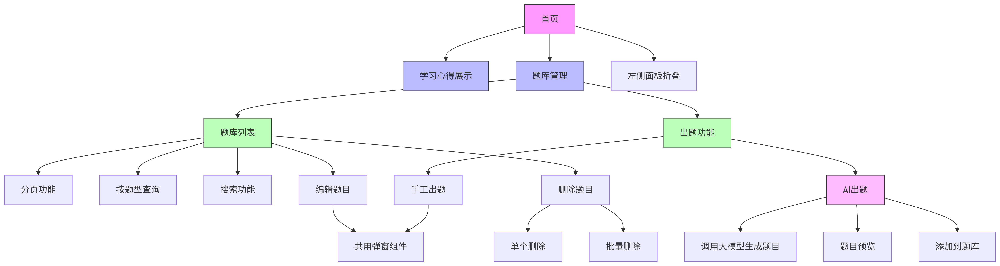
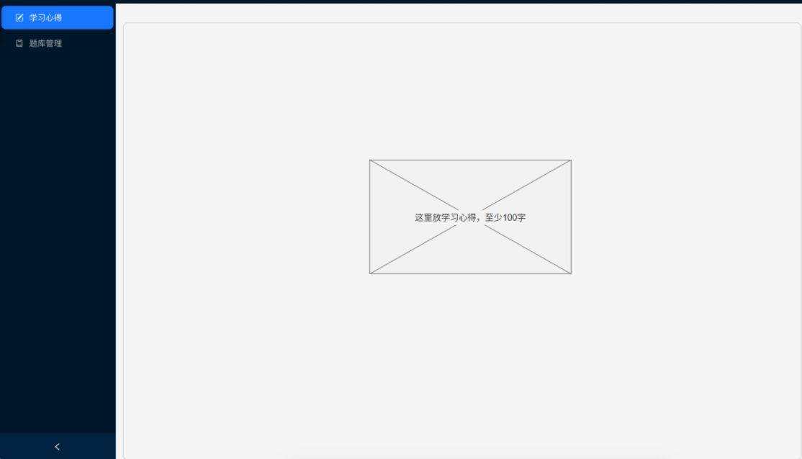

# 考试出题系统

使用方法：
1. 下载仓库到本地，并在client目录下运行
```bash
npm install
```
2. 然后再运行
```bash
npm run build
```
3. 最后打开server目录，运行如下代码：
```bash
go mod tidy
go run main.go
```
4. 如果要启用ai出题功能请打开.env文件并添加自己的api_key(如果想要使用其他ai，请同步更新ai的URL和MODEL)

**技术栈：**

- 前端：react ，使用vite搭建项目
- 后端：go，使用Gin框架

## 项目思路：

1. 仔细审阅功能需求，根据功能需求，进行[功能分析](#功能分析)
2. 建立[前端页面](#前端页面)大致布局
3. 根据功能设计[后端接口](#后端接口)
4. [数据库设计](#数据库设计)
5. 根据设计进行编码

### 功能分析



### 前端页面



### 后端项目结构

```
questionSystem/server/
├── api/
│ └── handler.go // 存放所有API的处理器函数 (handlers)
│ └── middleware.go // 存放错误处理等中间件
├── config/
│ └── config.go // 负责读取和管理配置 (例如 .env 文件)
├── model/
│ └── model.go // 存放所有的数据结构定义 (structs)
├── router/
│ └── router.go // 负责设置所有 Gin 路由
├── service/
│ └── ai_service.go // 存放与AI服务交互的业务逻辑
├── store/
│ └── db.go // 存放所有数据库操作相关的代码
├── .env
├── go.mod
├── go.sum
├── main.go // 主入口文件，负责初始化和启动服务
└── questionSystem.db
```

### 后端接口

端口：localhost:8080

- 调用AI接口示例：`POST /api/questions/create`

请求参数：

```json
{
    "number": 1,
    "language": "go",
    "type": 1,
    "difficulty": 1,
    "keyword": "冒泡排序"
}
```

返回参数：

```json
{
    "code": 0,
    "msg": "success",
    "data": [
        {
            "id": 0,
            "title": "以下哪个是冒泡排序的正确实现（从小到大排序）？",
            "answers": [
                "A. func bubbleSort(arr []int) { for i := 0; i < len(arr)-1; i++ { for j := 0; j < len(arr)-i-1; j++ { if arr[j] > arr[j+1] { arr[j], arr[j+1] = arr[j+1], arr[j] } } } }",
                "B. func bubbleSort(arr []int) { for i := 0; i < len(arr); i++ { for j := i + 1; j < len(arr); j++ { if arr[i] > arr[j] { arr[i], arr[j] = arr[j], arr[i] } } } }",
                "C. func bubbleSort(arr []int) { for i := 0; i < len(arr)-1; i++ { for j := 0; j < len(arr)-1; j++ { if arr[j] < arr[j+1] { arr[j], arr[j+1] = arr[j+1], arr[j] } } } }",
                "D. func bubbleSort(arr []int) { for i := 0; i < len(arr)-1; i++ { for j := i; j < len(arr)-1; j++ { if arr[j] > arr[j+1] { arr[j], arr[j+1] = arr[j+1], arr[j] } } } }"
            ],
            "right": [
                "A"
            ],
            "type_id": 1,
            "difficulty": 1,
            "is_ai": 1,
            "language": "go",
            "keyword": "冒泡排序",
            "active": 1
        }
    ]
}
```

- 查询题库接口：`GET /api/questions`

请求参数示例：

```json
{
    "number": 2,
    "language": "go",
    "type": 2,
    "difficulty": 3,
    "keyword": "map的并发操作"
}
```

返回参数：

```json
{
    "code": 0,
    "msg": "success",
    "data": [
        {
            "id": 3,
            "title": "在Go语言中，如何声明一个包含3个整数的数组？",
            "answers": [
                "A. var arr [3]int",
                "B. arr := []int{1, 2, 3}",
                "C. arr := make([]int, 3)",
                "D. arr := array{1, 2, 3}"
            ],
            "right": [
                "A"
            ],
            "type_id": 1,
            "difficulty": 1,
            "is_ai": 1,
            "language": "go",
            "keyword": "数组",
            "active": 1
        },
        ...]
}
```

- 添加题目接口：`POST /api/questions/add`

请求参数示例：

```json
{
    "title":"Gin框架的作用是什么",
    "answers":["A.Gin是一个用于前端开发的JavaScript框架，类似React或Vue","B.Gin是Go语言的高性能HTTP Web框架，支持路由分组、中间件等功能","C.Gin主要用于数据库操作，是ORM工具的一种","D.Gin是Python的异步Web框架，类似Django或Flask"],
    "right":["B"],
    "type_id":1,
    "difficulty":2,
    "language":"go",
    "keyword":"Gin框架"
}
```

返回参数：

```json
{
    "code":0,
    "msg":"题目添加成功",
    "data":null
}
```

- 编辑题目接口：`POST /api/questions/edit`

请求参数示例：

```json
{
    "title":"请用go语言实现快速排序算法",
    "type_id":3,
    "difficulty":2,
    "language":"go",
    "keyword":"快速排序"
}
```

返回参数：

```json
{
    "code":0,
    "msg":"题目更新成功",
    "data":null
}
```

- 删除题目接口：`POST /api/questions/delete`（这里设计为**逻辑删除**）

请求参数示例：

```json
{
    "id":17,
    "title": "test",
    "type_id": 1,
    "difficulty": 1,
    "language": "go",
    "keyword": "test"
}
```

返回参数：

```json
{
    "code":0,
    "msg":"题目删除成功",
    "data":null
}
```

### 数据库设计

**题目表：**（questions）

|   字段名   | 字段类型 |                 说明                 |
| :--------: | :------: | :----------------------------------: |
|     id     | INTEGER  |              主键，自增              |
|   title    |   TEXT   |                 题目                 |
|  answers   |   JSON   |               题目选项               |
|   right    |   JSON   |               正确选项               |
|  type_id   | INTEGER  |   1为单选题，2为多选题，3为编程题    |
| difficulty | INTEGER  |      1为简单，2为中等，3为困难       |
|   is_ai    | INTEGER  |  0为手动添加的题目，1为AI生成的题目  |
|  language  |   TEXT   |            题目的编程语言            |
|  keyword   |   TEXT   | 该题的关键词（可依靠关键词模糊搜索） |
|   active   | INTEGER  |    是否被删除，默认为1,被删除为0     |
